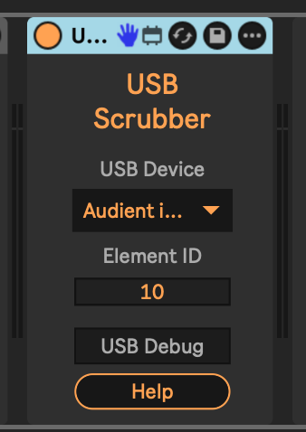

# USB Scrubber

This is a Max For Live device that lets you use a USB Human Interface Device knob to scrub the playback position in Ableton Live's Arrangement view.

* [Video of it in action.](https://www.youtube.com/shorts/W_D2bYVQDyA)

## Installation

Use a download link at the top or bottom of this page, or [download the newest .amxd file from the latest GitHub release](https://github.com/zsteinkamp/m4l-USBScrubber/releases) or clone [this repository](https://github.com/zsteinkamp/m4l-USBScrubber), and drag the `USBScrubber.amxd` device into a track in Ableton Live.

## USB Setup

> NOTE: I have tested this in "iD" mode of my Audient iD14. I have no idea if it will work with other devices, so I'm just taking a good guess here with configuration / configurability.

Mapping process:

- Choose your USB device from the drop-down.
- Enable `USB Debug` mode to print data received from that device in the Max console. To see the console, right-click the title bar of this device and choose `Open Max Window`.
- Move whatever controller you want to use.
- Note the output in the Max console window. The output is `{element} {value}`.
  - My iD14 knob outputs as element 10, so that's why it is the default.
- Change the `Element ID` field to the element your controller is emitting.
- ... at this point the controller should be able to scrub along the timeline in Arrangement view.

## Usage

Turn the USB knob in one direction or another to scrub the playback position in Arrangement view.

## Changelog

- 2022-04-09 - [v1](https://github.com/zsteinkamp/m4l-USBScrubber/releases/tag/v1) - Initial Rev

## TODO

- ...
